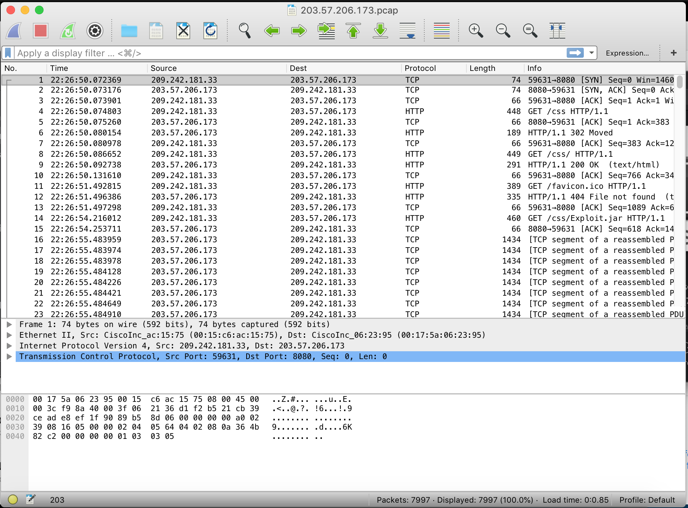
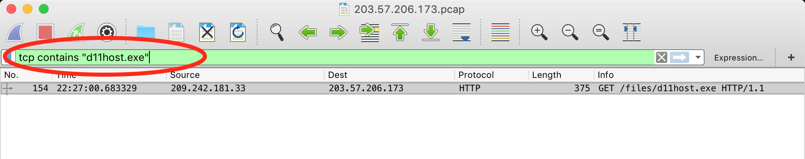
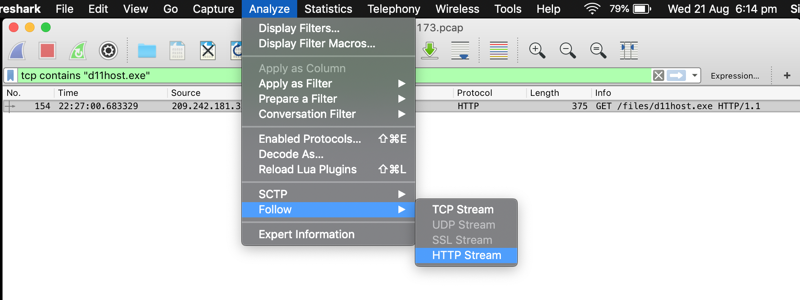
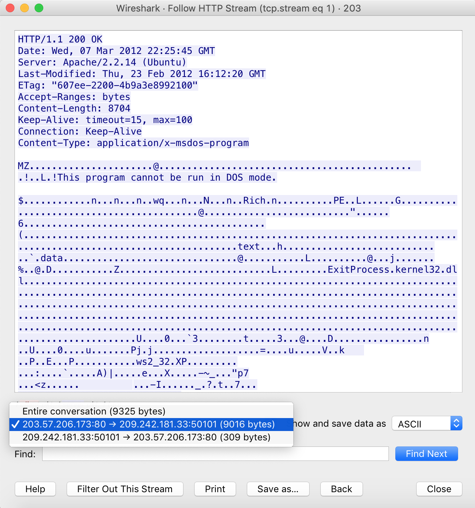
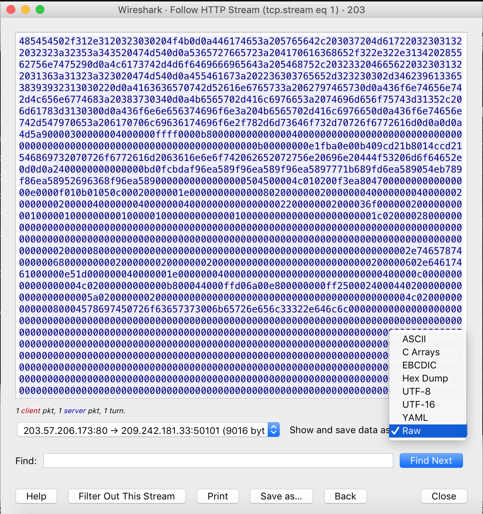
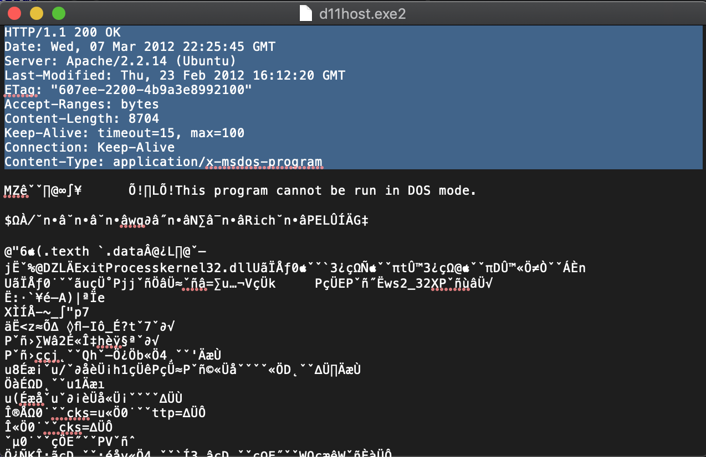
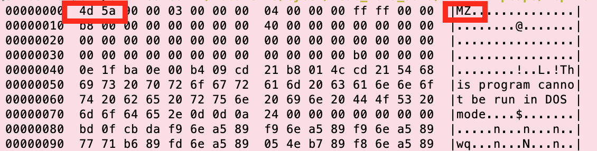

<style>
	hr { height: 0; page-break-after: always; }
	
</style>

# Mini NCAC Challenge
--


### Introduction 

This is a condensed version of the previously conducted National Cyber Analyst Challenge (NCAC). As the name suggests, it will require you to think creatively and conduct online research to find the answers. It is unlikely you will be able to complete the entirety of the challenge in less than 10 hours. However, to help you learn and progress quickly, the data has been strategically minimized and some pointers are given.

The data can be downloaded here: [here.](https://drive.google.com/open?id=1Bpl8h6HcJHtl_A9zXAcqJu8WyY3JuR7f)


### Instructions / Indicators

The FBI called to inform you they noticed traffic from your company to a known bad APT drop site. Details were sketchy and sparse as usual; however, the FBI indicated that it observed a file “d.7z” being transferred. No analysis of the contents of the file was conducted (or they didn’t care to share).

Although there is no evidence the attackers used email as a delivery vector, the FBI indicated this particular adversary regularly uses career-type themes to target job seekers and HR personnel. Previously observed email Subjects were:

“Your CV has been updated”  
“Take career to your level next”   
“Tried of grind”   
“opportunity waits”  

No other information is available at this time.   


<hr class="page">


## Section 1


### Question 1

*The FBI report mentions a file "d.7z" was observed being transfered. This indicator seems like a good starting point
for our analysis. If the file was transfered into or out of the network, it should be logged in our Border Device Logs.
Let's see if we can find out what happened to it.*

**Q: The file "d.7z" was retrieved from this external IP address.**  

> Hint: Grep for the file name in firewall.log
> 
> To find all the lines containing the phrase "filename.7z" in the file firewall.log, you can run the command:
> ``` grep "filename.7z" firewall.log```


### Question 2

*We now know which IP address was associated with the reported file. This is potentially a malicious IP address. 
So we should probably check what other activity is associated with that IP at the firewall.*

**Q: In addition to d.7z these three other zip files were stored to an external source at about the same time**  

> Hint: 
> 
> * Grep for the malicious IP address in the firewall.log. 
> * e.g.: ```grep "xxx.xxx.xxx.xxx" firewall.log | less```
> * Eyeball the results
> * The files should have ".7z" extension

### Question 3

**Q: This exe file was retrieved from the same IP address **  

> Hint: 
> 
> * Grep for 203.57.206.173 in firewall.log. 
> * You can grep for two terms by piping the results of one grep to another command
> * e.g. ```cat firewall.log | grep xxx.xxx.xxx.xxx | grep "otherterm" | less```
> * Eyeball the results


<hr class="page">

## Section 2 

### Question 4

*The FBI report also tells us that the adversary has a propensity to use job or career themes for their phishing emails. It is not unlikely they would use the same theme to target users by other means. It seems one SICCO's users is actually looking for a new job. This would make him a vulnerable target to any such attacks. Since we have a potential adversary IP, we can check if there is any web browsing associated with it.*

**Q: A user downloaded an executable while browsing a career themed watering hole with related to the malicious IP. The domain of that website is:**  

> Hint: 
> ___.____.com
> * Grep for 203.57.206.173 accross all the Border device logs. 
> * The answer should be in the squid_proxy.log

### Question 5

**Q: The name of the malicious executable is**  
	
> Hint: Same as above

### Question 6

*Using the malicious IP address we found earlier, we were able to discover a malicious domain that served malware to a Sicco Inc user. We can now pivot on that domain to see if we can discover additional adversary IP addresses.*

**Q: This external IP address is also associated with the domain mentioned above**  

> Hint: Grep for the domain in the squid proxy. If the domain you are searching for does not return any results, it may be helpful to broaden your search by dropping the subdomain. 
> 
> For example, if searching for `specific.domain.com` returns no results, search for `domain.com` instead. 


### Question 7


**Q: What is the md5 hash of the file?**  

> Hint:  
> 
> * Open 203.57.206.173.pcap in Wireshark. 
> 

> 
> * Filter on  `'tcp contains "d11host.exe"'`.  
> 
> * Follow the stream (Analyze > Follow> HTTP Stream). This is look different for you based on your operating system. 
> 
> 
> * Make sure to select only the HTTP response.  
> 
> 
> * Save the **raw** data d11host.exe.   
> 
> 
> * You will need to remove the HTTP response header (can be done in most texteditor - or in Vim!).
> 
> 
> * Use the md5 command on the file to get the hash. 
> 	* e.g.: `md5 d11host.exe`
> * Additonal hint: Since it is an `exe` file, the first two bytes should be [4d 5a] or "MZ"
> 	* You can check by running the command: `hexdump -Cv d11host.exe | less`
> 


### Question 8

**Q: The executable is a strain of this Remote Access Tool**  

> Hint: 
> 
> Look up the hash on virustotal.com.
> 
> * Virutotal (VT) is a malware repository that allows you to check what files others have uploaded how they are classifies by various antivirus engines.
> * You could also upload the file to VT, but that is already done for you. 
> * https://www.virustotal.com/gui/file/d6b813f39580a9f033635703f6d35e08fc0c3fbb06161660d6a113ccaa60b3dc/detection
> *Note: for real world APT, you should probably not upload the file immediately.*
	
	

### Question 9

**Q: The user also downloaded two scripts that automate ftp tasks. The scripts are named ___.txt**  
> Hint: 
> 
> * This requires one grep command piped into another.  
> 	* For example: ```grep -r mydomain.com  . | grep ".txt" | less```  
> * The `"."` indicates that we are running the search across all files in the current folder. Use this conservatively.  
> Note the 404 response code on `ftb_helo.txt`


<hr class="page">

## Section 3

*We now have several of indicators of the adversary's activity. Now is a good time to step back and try to build a full story of the adversary's journey into the network. It would be helpful to know what information the hacker has about Sicco Inc, how he obtained that information, and how he chose his targets. This broader view can help us discover additional pieces of the puzzle he had not seen before.*

### Question 10

**Q: The adversary IP Address 60.235.12.64, performed some reconnaissance on SICCO INC before the attack. Based on the blog ____ is the leading APT detection software developed by SICCO, Inc:**  
	
> Hint: 
> 
> * Go back to the conviniently supplied 60.235.12.64.pcap. Open it in Wireshark.
> * Filter on the org's domain: "siccoinc.com" -- ```tcp contains "siccoinc.com"```
> * Scroll down and look for the Get request to blog.html 
> * Follow the stream 
> * Read the page content, ignore the html

### Question 11

**Q: Sicco Inc. launched a partnership with this company in order to develop the Vortex product.**  

> Hint: 
> 
> Same as above. Read carefully. 

### Question 12

**Q: The president & owner of that company is named:**  
	
> Hint: 
> 
> The information isn't contained on Sicco Inc's website. 
> You will need to look in the mail traffic (mail.pcap).
> 
> * You can filter on `tcp contains "Illusory" and tcp contains "President"`
> * You will need to read past the first few emails


### Question 13

**Q: Several Sicco Inc employees received an email atttachment which Diggler claims he never sent. The name of that attachment is:**

> Hint: 
> 
> From the last question we know that Dirk Diggler's email address is "dirkdiggler853@gmail.com". 
> We can filter on that email adress and read through the conversations. 
> The confusion is detailed in an email thread with  Jules Winnfield. This tasks is easier done using ngrep.


### Question 14

**Q: There were 4 recipients to the mysterious attachments. Their email addresses are:**  

> Hint: 
> 
> In wireshark, filter on "2012\_Incentive\_Plan.pdf". 
> Follow the four streams.

### Question 15

**Q: A legitimate email from Dirk Diggler (dirkdiggler853) would normally come from this email server**  

> Hint: 
> 
> The email thread with Jules Winnfield sounds like the real guy. Look at the email headers.  

### Question 16

**Q: The spoofed message from Diggler came from this mail server**  

> Hint: The email containing only the pdf attachment and a vague message sounds spoofeed. Check the email headers. 

### Question 17

**Q: The attachment in encoded in:**  

> Hint: 
> 
> A quick google search reveals the answer. 
> If you can't find it, look [here](https://www.cisco.com/c/en/us/support/docs/security/email-security-appliance/118499-qa-esa-00.html).

### Question 18

**Q: The pdf says:**  
	
> Hint: 
> 
> You will need to carve the file out of the email. 
> 
> * In mail.pcap, filter for 2012_Incentive_Plan.pdf
> 	* `tcp contains "2012_Incentive_Plan.pdf"`
> * Analyse > Follow > TCP Stream, for one of the streams to get the emails
> * Copy and paste the base64 data into a file (ex: attachment.b64). The base64 data is a big block of garbled letters that end with "="
> * Base64 decode the data and write it to a new file. Ex: ```base64 -D attachment.b64 >> 2012_Incentive_Plan.pdf```
> * Open the file

### Question 19

**Q: The hash of the file is:**  

> Hint: Use the md5 command

### Question 20

**Q: This employee actually downloaded the pdf attachment**  
	
> Hint: 
> If a user actuallly downloaded the file (if it is written on disk), 
	it should show up in their Master File Table (conviniently supplied).
	
> * In the MFT folder, grep for the file name: ```grep -r 2012_Incentive_Plan.pdf . | less```
> * Which client does it show up on? Who is that client allocated to?

<hr class="page">


## Section 4 

### Question 21

**Q: The adversary (203.57.206.173) downloaded a series tools on this user's machine**    

> Hint: 
> 
> This going back to the initial thread. 
> 
> * Open 203.57.206.173.pcap and filter on port 443. 
> * Follow any of the streams and you should get a pretty thorough list of what the adversary is doing. 

### Question 22

**Q: The adversary's tools were stored in this folder:  C:\Windows\\____\ **  

> Hint: 
> 
> Same as above, just read carefully.

### Question 23

**Q: During the Adversary's command and control sessions, they used this Helpdesk password to run the psexec process **  

> Hint:  
> 
> Same as above.

### Question 24

**Q: The adversary dumps system/user passwords in this file:**  

> Hint: 
> 
> Same as above

### Question 25

**Q: The adversary exfiltrated this employee's emails by first consolidating them in a file called _____.pst**  

> Hint: 
> 
> Look at the contents of the Roskow's machine: SICCO446EQ_singlefile.machine.contents

### Question 26

**Q: The employee whose emails were stolen is:**  

> Hint: 
> 
> Same as above

